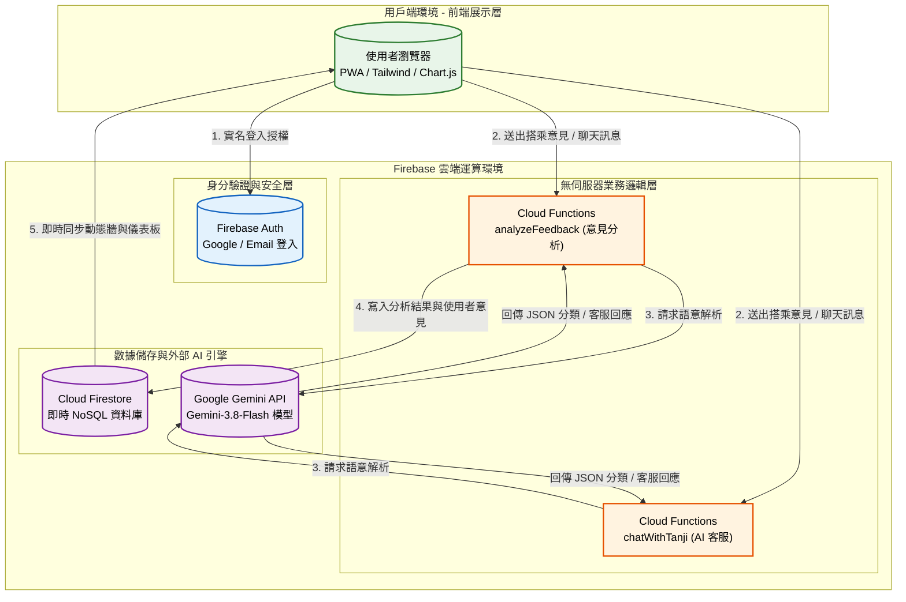

# 碳吉 TanJi：三鶯永續行 AI 智慧交通公民共創平台 🍃

## 1. 專案介紹

### 1.1 系統目的簡介

本系統旨在協助地方交通主管機關（如：新北市交通局、捷運工程局）與大眾運輸營運單位，解決綠色運輸系統（如：捷運三鶯線）在轉乘接駁上的盲區。透過「零阻力公民共創表單」與「Gemini AI 智能解析引擎」兩大核心，整合 Firebase Serverless 架構與 Google LLM，將龐雜、情緒化的非結構化民眾回饋，轉化為直觀、可量化的決策儀表板，藉由「碳吉」點數經濟，建立雙向的永續交通生態圈。

---

## 2. 系統架構與範圍

### 2.1 系統架構圖

本系統採用 **資料驅動的無伺服器架構 (Serverless)** 設計，並區分為用戶端、雲端運算環境與 AI 數據層。



### 2.2 系統範圍

* **展示層**: 採用 Tailwind CSS 建構行動優先 (Mobile-first) 介面，並以 Chart.js 負責交通儀表板的數據視覺化渲染。
* **業務邏輯層**: 依賴 Firebase Cloud Functions 建立安全後端，處理 `analyzeFeedback` 與 `chatWithTanji` 的 AI 提示詞工程邏輯，保護 API Key 不外洩。
* **數據存取層**: 核心串接 Google Gemini API 進行語意標註，並以 Firebase Firestore 實現資料即時雙向綁定 (Real-time synchronization)。

### 2.3 交付項目

1. **網頁應用程式**: `index.html` (整合 Tailwind CSS, Chart.js, Firebase Web SDK)。
2. **後端代理函數**: Firebase Cloud Functions 程式碼 (`index.js`)。
3. **系統規格文件**: 本 README 規格書。

---

## 3. 業務功能需求

| 需求編號 | 功能名稱 | 參與者 | 功能描述 | 業務邏輯/備註 |
| --- | --- | --- | --- | --- |
| **FR-01** | **會員實名防護** | 乘車民眾 | 支援 Google 一鍵登入與 Email 註冊，註冊時需同意社群守則。 | 確保數據真實性，防範機器人洗版，達成「實名認證、匿名發文」。 |
| **FR-02** | **多維度意見採集** | 乘車民眾 | 讓使用者輸入發生站點、時段、天候、相關運具與現場照片。 | 提供比傳統文字信箱更具空間與環境參考價值的微觀數據。 |
| **FR-03** | **AI 智能語意引擎** | 系統 | 自動將非結構化文字歸納為 5 大議題標籤，並判定正負面情緒。 | 透過 Gemini API 嚴格鎖定 JSON 輸出，免去公務員人工分類成本。 |
| **FR-04** | **永續點數經濟** | 乘車民眾 | 註冊獲 50 點，成功發佈意見獲 10 點，同步換算綠色減碳量。 | 點數（碳吉）未來可結合三鶯在地商圈進行 O2O 經濟折抵。 |
| **FR-05** | **碳吉小幫手** | 乘車民眾 | 24H 智慧客服，提供集點規則、三鶯線資訊問答與情緒安撫。 | 注入 `system_instruction` 限定 AI 導覽員的友善人設與回答範圍。 |
| **FR-06** | **交通治理儀表板** | 政府/營運方 | 將市民回饋即時轉化為「站點熱區」、「議題分佈」與「情緒圓餅圖」。 | 具備權限鎖（Auth Code），並支援一鍵匯出 CSV 報表供後續決策。 |

---

## 4. 非業務功能需求

### 4.1 安全性要求

* **API 金鑰保護**: Google Gemini API Key 透過 Firebase Secret Manager 儲存於雲端，前端絕不暴露敏感金鑰。
* **傳輸加密**: 全程使用 **HTTPS** 協定進行 API 通訊與資料庫讀寫。
* **CORS 與驗證**: Cloud Functions 實作 `request.auth` 攔截，未登入者無法呼叫 AI 分析消耗資源。

### 4.2 系統效能

* **無伺服器擴容**: Cloud Functions 支援 `maxInstances` 設定，可依據通車尖峰時段流量自動彈性擴容。
* **非同步響應**: 意見送出時前端即時呈現 Loader 狀態，背景非同步等待 LLM 推論回傳。

### 4.3 可用性與準確性

* **容錯機制**: 若 AI 引擎逾時或回傳格式錯誤，系統設計有 Default Fallback（自動歸類為「其他建議」與「neutral」情緒），確保資料庫不崩潰。
* **跨裝置支援**: 採 PWA 設計理念，介面完全適配從手機、平板到桌機的螢幕尺寸。

---

## 5. 系統介面設計

### 5.1 API 規格

系統透過 Firebase Cloud Functions 提供前端呼叫端點 (Callable Functions)。

#### 介面 A: 意見智能分析 (analyzeFeedback)

* **呼叫方式**: `httpsCallable(functions, 'analyzeFeedback')`
* **輸入**: `{ "content": "早上尖峰時段頂埔站外面沒遮雨棚淋成落湯雞..." }`
* **輸出**: 嚴格定義之 JSON 格式

```json
{
  "ai_category": "候車與周邊環境",
  "ai_sentiment": "negative"
}

```

#### 介面 B: 碳吉小幫手對話 (chatWithTanji)

* **呼叫方式**: `httpsCallable(functions, 'chatWithTanji')`
* **輸入**: `{ "message": "請問怎麼累積碳吉點數？" }`
* **輸出**: JSON 格式

```json
{
  "reply": "只要完成會員註冊就可以獲得 50 點，每次分享真實搭乘體驗還能再得 10 點喔！😊"
}

```

---

## 6. 專案安裝與部署

### 前置需求

* Node.js 環境 (v18+)
* Firebase CLI 工具 (`npm install -g firebase-tools`)
* 已開通之 Google Gemini API 金鑰

### 部署步驟

1. **環境初始化**:
* 進入 `functions` 目錄執行 `npm install`。
* 透過指令登入 Firebase 帳號：`firebase login`。
* 選擇對應的專案 ID：`firebase use sanying-e8ba1`。


2. **設定環境變數 (金鑰管理)**:
* 將 Gemini API Key 存入 Firebase Secret Manager：
`firebase functions:secrets:set OPENAI_API_KEY`


3. **後端部署 (Cloud Functions)**:
* 執行 `firebase deploy --only functions` 完成後端部署。


4. **前端設定與測試**:
* 確保 `index.html` 中的 Firebase Config 已正確配置。
* 以 Live Server 啟動 `index.html` 或將其部署至 Firebase Hosting / GitHub Pages 即可開始使用。
